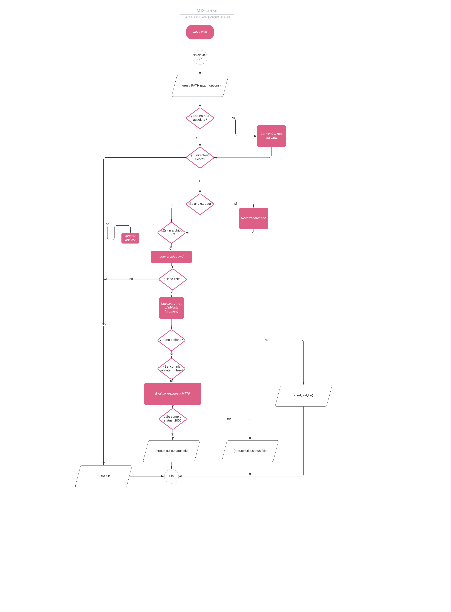
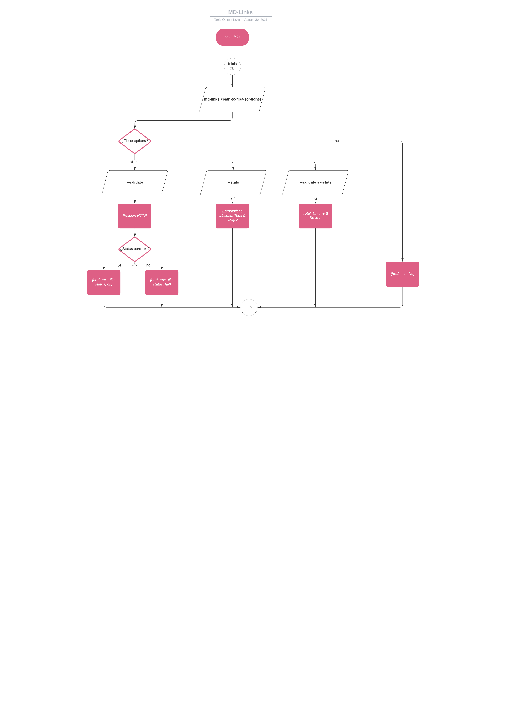

# Md-links

## Índice

- [1. Preámbulo](#1-preámbulo)
- [2. Resumen del proyecto](#2-resumen-del-proyecto)
- [3. Diagrama de flujo](#3-diagrama-de-flujo)
- [4. Guía de uso](#4-guía-de-uso)
---

## 1. Preámbulo

[Markdown](https://es.wikipedia.org/wiki/Markdown) es un lenguaje de marcado
ligero muy popular entre developers. Es usado en muchísimas plataformas que
manejan texto plano (GitHub, foros, blogs, ...), y es muy común
encontrar varios archivos en ese formato en cualquier tipo de repositorio.

Estos archivos `Markdown` normalmente contienen _links_ (vínculos/ligas) que
muchas veces están rotos o ya no son válidos y eso perjudica mucho el valor de
la información que se quiere compartir.

## 2. Resumen del proyecto

Mdlinks es una libreria creada a partir de NodeJS, la cual leer y analiza archivos (o directorios) que están en formato Markdown(.md). Además, permite obtener estadísticas y validar el estado del link (si esta roto o es válido).

## 3. Diagrama de flujo




## 4. Guía de uso

## Instalación

Instala la librería con npm:

```npm i mdlinks-tql ```


Instala la librería con github:

```npm install TaniQL/LIM015-md-links```


## Utilizarlo como librería


```const mdlinks = require('tql-mdlinks'); ```

Exporta la función mdLinks(<path>,<options>) este retorna una promesa, donde se resuelve un array de objetos, en caso de fallar devolverá el error.

Parámetros:
- path: (string) Ruta absoluta o relativa al archivo o directorio de donde se invoca.
- options: (objeto) con las siguiente propiedad:
   * validate: (bool) que determina si se desea validar los links encontrados.
      - false: retorna un array de objetos con  3 propiedades.
  ```
      [
       {
        href, //(string) link
        path, //(string) ruta absoluta
        text, //(string) texto
        }
      ]
      ```
      - true retorna un array de objetos con 5 propiedades.
  ```
      [
       {
        href, //(string) link
        path, //(string) ruta absoluta
        text, //(string) texto
        status, ///(int) estado del link
        message, ///(string) estado del link
       }
     ]
     ```

## Ejemplo de Uso

 ```
 const mdlinks = require('tql-mdlinks');
  mdLinks("./some/example.md", { validate: false })
  .then(links => {
    // => [{ href, text, file }]
  })
  .catch(console.error);

  mdlinks("./some/example.md", { validate: true })
  .then(links => {
    // => [{ href, text, file, status, ok }]
  })
  .catch(console.error);

```

## CLI (Command Line Interface - Interfaz de Línea de Comando)

El ejecutable de nuestra aplicación debe poder ejecutarse de la siguiente
manera a través de la terminal:

`md-links <path-to-file> [options]`

Por ejemplo:

```sh
$ md-links ./some/example.md
./some/example.md http://algo.com/2/3/ Link a algo
./some/example.md https://otra-cosa.net/algun-doc.html algún doc
./some/example.md http://google.com/ Google
```

El comportamiento por defecto no debe validar si las URLs responden ok o no,
solo debe identificar el archivo markdown (a partir de la ruta que recibe como
argumento), analizar el archivo Markdown e imprimir los links que vaya
encontrando, junto con la ruta del archivo donde aparece y el texto
que hay dentro del link (truncado a 50 caracteres).

#### Options

##### `--validate`

Si pasamos la opción `--validate`, el módulo debe hacer una petición HTTP para
averiguar si el link funciona o no. Si el link resulta en una redirección a una
URL que responde ok, entonces consideraremos el link como ok.

Por ejemplo:

```sh
$ md-links ./some/example.md --validate
./some/example.md http://algo.com/2/3/ ok 200 Link a algo
./some/example.md https://otra-cosa.net/algun-doc.html fail 404 algún doc
./some/example.md http://google.com/ ok 301 Google
```

Vemos que el _output_ en este caso incluye la palabra `ok` o `fail` después de
la URL, así como el status de la respuesta recibida a la petición HTTP a dicha
URL.

##### `--stats`

Si pasamos la opción `--stats` el output (salida) será un texto con estadísticas
básicas sobre los links.

```sh
$ md-links ./some/example.md --stats
Total: 3
Unique: 3
```

##### `--stats -- validate`
También podemos combinar `--stats` y `--validate` para obtener estadísticas que
necesiten de los resultados de la validación.

```sh
$ md-links ./some/example.md --stats --validate
Total: 3
Unique: 3
Broken: 1
```